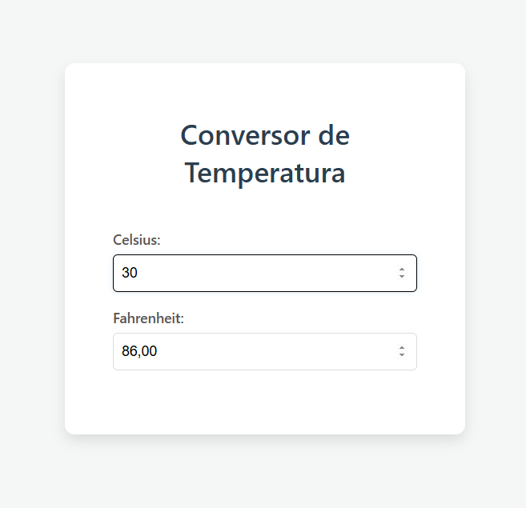

<h1>CONVERSOR DE FAHRENHEIT PARA CELSIUS</h1>
<h2>O QUE É O PROJETO?</h2>
  O conversor de fahrenheit serve tanto na área de trabalho quanto para interesse público e também sendo cobrado no hambito escolar, feito em 1724 o fahrenheit(°F) é usado no sistema de medida usado no esterior para medir a temperatura. Mais quem o ultilizaria? tanto professores e alunos e turistas que necessitam asemelhar-se com sistema da temperatura do local, e nas escolas para os alunos seria como fonte e pesquisa e entendimento dessa medida que também é cobrada no curriculo escolar.
  
<b>Imagem ilustrativa</b></img>
<button a href='https://projeto-pessoal-de-qualidade-de-tes.vercel.app/'></button>
  

Como na imagem acima o projeto funciona da seguinte forma: O usuário coloca a númeração dentro da caixa de texto, pode ser usada tanto na parte de CELSIUS quanto em FAHRENHEIT, e após digitar já aparece o resultado da conversão.

<h2>QUAL  A IMPORTÂNCIA E QUANDO USAR?</h2>
Sua importancia se da quando é preciso ajustar aparelhos tanto aquecedores ou arcondicionados em ambientes estrangeiros, resolvendo o problema de muitos que não sabem como converter e também do fácil acesso ao site disponível para quem precisa. Também vale ressaltar que o entendimento desse sistema serve para conhecimento comum dos que foram almejados com o projeto.

<h2>COMO FUNCIONA ESSE SISTEMA ?</h2>

A conversão de Fahrenheit para Celsius é simples! Basta subtrair 32 da temperatura em Fahrenheit e depois dividir o resultado por 1.8. a seguinte fórmula demonstra como se é calculado:
 <a> 𝐶 = (𝐹−32)/1.8 </a>

Exemplo: 100°F → (100 - 32) ÷ 1.8 = 37.8°C

A temperatura em Fahrenheit pode ser comparada à brasileira convertendo os valores para Celsius, que é a escala usada no Brasil. Como referência:

<li>30°C no Brasil seria aproximadamente 86°F nos EUA.</li>

<li>40°C (um dia bem quente no Brasil) equivale a 104°F.</li>

<li>20°C (clima ameno) corresponde a 68°F.</li>

Exemplo do código funcionando:

  
<b>foto do código em funcionamento</b></img>
<button a href='https://projeto-pessoal-de-qualidade-de-tes.vercel.app/'></button>

<h2>Linguagens Usadas:</h2>

React, javascript, css entre outros

<h4>Feito por: Daiara Maria e Ana Larissa</h4>

